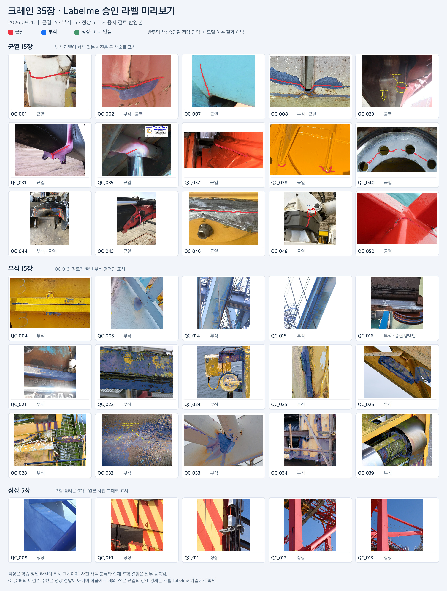

# 크레인 사진 35장을 활용한 균열·부식 모델 파인튜닝 예비실험

**실험일: 2026년 9월 26일 | 작성: 정수빈 | 실행 환경: Google Colab · NVIDIA T4**

기존에 균열과 부식을 학습한 모델에 실제 크레인 사진을 추가로 학습시킨 뒤, 결함을 찾는 결과가 얼마나 달라지는지 확인한 예비실험.

균열 15장·부식 15장·정상 5장을 수집하고, 사진과 라벨 검토를 거쳐 두 모델의 추가 학습 및 전후 비교까지 완료. 검증에서 두 모델의 IoU는 소폭 상승했으나, 균열 모델은 잘못 검출하는 영역도 증가. 부식 모델은 추가 검증 후보로 판단했으며, 실제 운영 모델의 교체는 보류.

## 1. 무엇을 확인하기 위한 실험인가

기존 모델이 다른 환경의 결함 사진을 학습했더라도, 크레인의 도장면·용접부·부재 모서리·그림자를 만나면 결함과 혼동할 가능성 존재. 이번 실험의 질문은 **“소량의 크레인 사진으로 추가 학습했을 때, 같은 검증 사진에서 기존 모델보다 나아지는가?”**.

| 구분 | 목표 |
|---|---|
| 이번 예비실험 | 균열 15장 + 부식 15장 + 정상 5장 = **35장**으로 학습 절차와 성능 변화 확인 |
| 이후 수집 목표 | 균열 50장 + 부식 50장 + 정상 20장 = **120장** 확보 |

이번 보고서의 대상은 35장 실험. 별도로 진행하는 120장 목표의 추가 수집분과 9월 23일의 이전 예비실험 결과는 미포함.

**전체 진행 순서**

1. **사진 수집** — 웹에 공개된 실제 크레인 점검·수리 사진 확보
2. **사진 선별** — 크레인 철제 부위 여부, 결함 가시성, 중복, 이미지 크기 확인 후 사용자 검토
3. **정답 표시** — Labelme로 결함 경계 표시 → 사용자 수정 요청 반영 → 최종 승인
4. **데이터 분할** — 같은 원본·장비·촬영 사례를 묶어 학습용과 검증용 분리
5. **파인튜닝** — 기존 균열 모델과 부식 기본모델에 학습용 사진을 각각 추가 학습
6. **전후 비교** — 같은 검증 사진과 같은 판정 기준으로 기존 모델과 추가 학습 모델 평가

## 2. 어떤 사진을 어떻게 수집했는가

### 2-1. 수집 방법과 출처

크레인 엔지니어링 업체의 기술 사례, 검사·수리 업체의 공개 사진, 정비 공지 PDF, 검사자의 공개 게시물에서 원본 사진 수집. 웹 이미지 다운로드 또는 PDF 안의 사진 추출 후, 결함이 보이는 사진은 그대로 사용하고 전경 사진은 필요한 철제 부위만 크롭.

새로 수집한 결함 30장에는 **기존 공개 학습 데이터셋의 재선별 이미지나 균열 합성 이미지 미사용**. 부식 기본모델의 사전 학습에 사용한 Corrosion CS v2는 이번 신규 수집 사진과 별도 구분.

| 구분 | 수량 | 대표 출처와 내용 |
|---|---:|---|
| 균열 | 15장 | Casper Phillips·Liftech의 크레인 균열 사례, Crane Tech 검사 사례, PALFINGER·EFFER 정비 공지, 검사자의 공개 게시물 등 |
| 부식 | 15장 | Cork 항만크레인 드론 점검, STS 크레인 구조 점검·보수, 해상 크레인 수리 사례 등 |
| 정상 | 5장 | 케냐 항만크레인 보수 사진과 Liebherr STS 크레인 사진에서 결함이 보이지 않는 철제 부위 선정 |
| **합계** | **35장** | **사용자 검토를 거친 고유 이미지 샘플 35개** |

대표 출처: [크레인 균열 사례](https://bridgerhowes.com/client-news/casper-phillips-associates/crane-cracks-and-fatigue/), [비파괴 검사 사례](https://craneservices.ca/non-destructive-testing/), [EFFER 정비 공지](https://static.nhtsa.gov/odi/tsbs/2023/MC-10230762-0001.pdf), [Cork 드론 점검 사례](https://www.engineerswithdrones.ie/case-studies/crane-inspection-case-study-cork.php), [STS 보수 사례](https://precisionaccesssolutions.com/product/kenya-ports-authority-sts-crane-refurbishment/).

### 2-2. 수량과 대상 범위의 의미

- **35장은 최종 이미지 샘플 수** — 서로 다른 크레인 35대 또는 독립적인 촬영 35회를 뜻하는 수량과 구분
- **전체 22개 출처·촬영 그룹** — 같은 크레인의 다른 부위 사진이나 같은 원본에서 나온 크롭을 포함한 구성
- **여러 종류의 크레인 철제 부재** — 초기 안벽크레인 한정에서 사용자 결정에 따라 트럭 탑재형·이동식·해상 크레인까지 확대
- **수집 규격** — 원본 기준 가로·세로 512픽셀 이상 확보, 작은 사진을 확대해 수량을 채우는 방식 제외

균열 사진 일부에는 검사 약품, 원본의 화살표·원 표시, 벌어진 파단 부위 포함. 따라서 본 자료의 성격은 **웹에서 수집한 크레인 결함 사진 기반 예비 데이터**이며, 실제 드론 촬영 조건과 일치하는 안벽크레인 전용 데이터로 확대 해석하지 않도록 구분.

## 3. Labelme로 무엇을 표시했는가

Labelme는 사진 위에 결함의 경계를 그리는 도구. 사진이 문제라면, 사람이 확인한 경계는 모델에 보여줄 **정답지**에 해당.

예를 들어 녹이 있는 사진에서 녹 부분의 외곽선을 다각형으로 표시하면, 그 안쪽을 `corrosion`으로 저장. 학습할 때는 이 다각형을 픽셀 단위 정답 그림인 **마스크**로 변환. 마스크는 각 위치가 결함인지 배경인지를 구분하는 이미지.

| 라벨 | 표시 기준 | 학습에서의 역할 |
|---|---|---|
| `crack` | 균열 경계를 따라 그린 다각형 | 균열 위치를 가르치는 정답 |
| `corrosion` | 녹이 보이는 표면을 감싼 다각형 | 부식 위치를 가르치는 정답 |
| 정상 | 결함 다각형 0개 | 결함이 없는 사진에서 잘못 반응하지 않도록 학습 |
| `ignore` | 정답 여부를 확정하지 못한 영역 | 학습 손실과 평가 계산에서 제외 |

AI가 만든 폴리곤 초안을 사용자가 검토하고, 경계 수정 및 제외 결정을 반영한 뒤 승인본 사용. 초안 생성 자체와 사용자 승인 완료를 구분하여 검토 기록 보존.

부분 라벨 사진 `QC_016`은 승인된 부식 픽셀만 학습에 사용. 주변의 미검수 영역을 정상으로 간주하지 않도록 모두 계산에서 제외하고, 해당 사진은 학습용에만 배정. 균열 여부가 불명확해 제외된 `QC_036`·`QC_049`는 최종 데이터에서 제외.

### 승인 라벨 전체 미리보기

빨강은 균열, 파랑은 부식, 정상 사진은 결함 표시 없음. 아래 그림은 모델 예측 결과가 아니라 **사용자 검토를 거친 정답 라벨의 위치**를 보여주는 미리보기. 얇은 균열은 축소 화면에서도 보이도록 경계선을 강조한 표시이며, 정확한 경계는 개별 Labelme 파일에서 확인.



## 4. Train·Validation·Test를 어떻게 나눴는가

### 4-1. 각 데이터의 역할

| 구분 | 쉽게 이해하는 비유 | 이번 실험에서의 사용 |
|---|---|---|
| **Train — 학습셋** | 정답을 보면서 공부하는 문제집 | 모델의 가중치를 바꾸는 추가 학습에 사용 |
| **Validation — 검증셋** | 공부 중 실력을 점검하는 모의고사 | 학습 경과 확인, 가장 좋은 학습 시점 선택, 전후 성능 비교에 사용 |
| **Test — 독립 시험셋** | 모든 설정을 정한 뒤 한 번 보는 최종 시험 | **이번 예비실험에서는 별도 구성하지 않음** |

### 4-2. 전체 35장의 분할

| 수집 분류 | Train | Validation | 합계 |
|---|---:|---:|---:|
| 균열 | 12 | 3 | 15 |
| 부식 | 12 | 3 | 15 |
| 정상 | 4 | 1 | 5 |
| **합계** | **28** | **7** | **35** |

검증 사진을 그대로 학습시키면 이미 공부한 문제로 시험을 보는 상황 발생. 이를 줄이기 위해 같은 원본뿐 아니라 같은 장비·촬영 사례로 확인되거나 동일 가능성이 있는 사진도 하나의 그룹으로 묶어 분할.

예를 들어 동일 Cork 크레인의 사진 6장은 모두 같은 분할에 배정. 케냐 항만크레인 보수 사례의 정상 사진 `QC_009`와 부식 사진 `QC_014`·`QC_015`도 같은 검증 분할에 배정. 분할은 모델 점수를 보기 전에 출처와 정답 분포를 기준으로 고정.

### 4-3. 모델별 장수가 다른 이유

이번 실험은 균열 전용 모델과 부식 전용 모델을 따로 학습하는 방식. 각 모델에는 **해당 결함의 라벨을 확인한 사진과 정상 사진**을 사용.

수집 장수에서 균열로 센 `QC_002`·`QC_008`·`QC_044`에는 부식 정답도 함께 존재. 이 3장을 부식 모델에서도 활용하면서, 부식 모델의 결함 사진 수는 수집 분류의 15장보다 많은 18장으로 구성.

| 모델 | 학습에 사용한 사진 | 검증에 사용한 사진 | 모델별 사용 합계 |
|---|---|---|---:|
| 균열 | 균열 12 + 정상 4 = **16장** | 균열 3 + 정상 1 = **4장** | 20장 |
| 부식 | 부식 14 + 정상 4 = **18장** | 부식 4 + 정상 1 = **5장** | 23장 |

두 모델 사이에 중복 사용하는 사진이 있으므로 20+23을 전체 고유 사진 수로 합산하지 않음. 고유 사진 수는 **35장 유지**. 다른 결함 사진에 해당 모델의 라벨이 없다는 이유만으로 정상 사진으로 처리하지 않음.

## 5. 파인튜닝에서 실제로 바뀐 부분

### 5-1. 시작점: 코드와 학습된 모델의 차이

학습 코드는 모델을 만들고 공부시키는 방법을 정리한 프로그램. **가중치**는 실제 사진을 학습하면서 모델 안에 저장된 값으로, 비유하면 이미 공부한 내용에 해당.

이번에는 학습된 가중치를 먼저 불러온 뒤, 크레인 사진으로 추가 학습을 진행. 이것이 본 보고서에서 말하는 **파인튜닝**.

| 모델 | 추가 학습의 시작점 |
|---|---|
| 균열 | 기존 E5 균열 모델의 `best_E5_tversky.pt` |
| 부식 | 9월 26일 Corrosion CS v2로 기본 학습을 완료한 부식 모델의 `best_corrosion_efficientnet-b0.pt` |

부식은 전달받은 코드만으로 과거의 학습 완료 가중치를 복원할 수 없어, 기본모델을 재학습한 뒤 그 결과를 이번 파인튜닝의 시작점으로 사용. 따라서 부식 결과표의 ‘파인튜닝 전’은 **이날 재학습한 부식 기본모델의 성능**.

두 모델의 구조는 U-Net + EfficientNet-B0. 사진에서 균열·부식의 위치를 픽셀 단위로 표시하는 분할 모델이며, 각각 하나의 결함과 배경을 구분하는 구성.

### 5-2. 적은 사진으로 학습하기 위한 설정

모델 앞부분인 **인코더**는 선·질감 등 사진의 특징을 추출하는 부분, 뒷부분인 **디코더와 분할 헤드**는 그 특징을 바탕으로 결함 영역을 정하는 부분.

이번에는 인코더와 인코더 내부의 BatchNorm 통계를 고정하고, 뒷부분만 추가 학습. 소량의 신규 사진으로 모델 전체가 크게 바뀌는 것을 제한하기 위한 설정.

| 설정 | 사용 값 | 의미 |
|---|---|---|
| 실행 환경 | Colab T4 GPU | 두 모델의 실제 추가 학습 및 검증 실행 |
| 입력 크기 | 512 × 512픽셀 | 모든 사진을 같은 크기로 변환 |
| Batch size | 2 | 한 번에 사진 2장씩 학습 |
| 학습률 | 0.00003 | 한 번에 모델을 바꾸는 정도를 작게 설정 |
| 최대 학습 횟수 | 20 epoch | 전체 학습 사진을 최대 20회 반복 |
| 조기 종료 | 5회 연속 검증 IoU 개선 없음 | 개선이 멈춘 뒤 불필요한 추가 반복 제한 |
| 최종 가중치 선택 | 결함 사진의 평균 검증 IoU가 가장 높은 시점 | 마지막 학습 시점 대신 가장 좋은 검증 시점 사용 |
| 판정 임계값 | 0.5 | 추가 학습 전후 동일한 결함 판정 기준 유지 |
| 학습 증강 | 좌우·상하 뒤집기, 밝기 조정 | 학습 사진의 방향과 밝기에 변화 부여; 검증에는 미적용 |

추가 기술 설정: AdamW 최적화, 균열 BCE+Tversky 손실, 부식 BCE+Dice 손실, 난수 시드 `20260926`.

## 6. 결과표의 점수를 읽는 방법

결과 비교는 **동일 검증 사진·동일 정답 마스크·동일 판정 기준**으로 수행. 파인튜닝 전 기본모델과, 검증 IoU가 가장 좋았던 추가 학습 모델을 비교.

| 지표 | 쉬운 설명 | 읽는 방향 |
|---|---|---|
| **IoU** | 정답 영역과 예측 영역이 얼마나 겹치는지를 나타내는 점수 | 1에 가까울수록 좋음 |
| **Dice** | 정답과 예측의 겹침을 다른 공식으로 나타낸 점수 | 1에 가까울수록 좋음 |
| **Recall — 재현율** | 실제 결함 영역 중 모델이 찾아낸 비율 | 낮을수록 놓친 결함이 많음 |
| **Precision — 정밀도** | 모델이 결함이라고 표시한 영역 중 실제 결함인 비율 | 낮을수록 잘못 칠한 영역이 많음 |
| **정상 사진 오탐** | 결함이 없는 사진에서 결함을 표시한 정도 | 낮을수록 좋음 |

**IoU 계산 예시:** 정답 부식 영역 100픽셀, 예측 영역 80픽셀, 겹친 영역 60픽셀인 경우, 합친 영역은 100+80−60=120픽셀. 따라서 IoU는 60÷120=**0.5**. 사진을 몇 장 맞혔는지 나타내는 정확도와 다른 지표.

아래 IoU·Dice·Recall·Precision은 **결함이 있는 검증 사진마다 점수를 계산한 뒤 평균한 값(macro 평균)**. 정상 사진은 별도의 오탐 지표로 평가. 변화 열은 반올림 전 원래 값으로 계산한 뒤 소수 넷째 자리까지 표시.

## 7. 실제 결과와 해석

### 7-1. 균열 모델: 더 많이 찾았지만 잘못 잡은 영역도 증가

학습 16장, 검증 4장으로 실행. 검증 구성은 균열 3장과 정상 1장. 전체 6회 학습 후 종료했으며, 가장 좋은 검증 IoU를 보인 **1회차 가중치**를 최종 비교에 사용.

| 지표 | 파인튜닝 전 | 파인튜닝 후 | 변화 |
|---|---:|---:|---:|
| IoU | 0.1127 | 0.1340 | +0.0213 |
| Dice | 0.1927 | 0.2194 | +0.0267 |
| Recall | 0.3361 | 0.4344 | +0.0983 |
| Precision | 0.3168 | 0.1854 | −0.1314 |
| 오탐이 발생한 정상 사진 | 1/1장 | 1/1장 | 동일 |
| 정상 사진에서 잘못 표시한 면적 비율 | 0.4471% | 0.4955% | +0.0484%p |

IoU와 Recall 상승은 이번 검증 사진에서 실제 균열 영역을 더 많이 찾아낸 변화. 그러나 Precision 하락은 결함으로 표시한 영역에 잘못된 예측이 더 많이 섞인 변화. 정상 사진에서도 오탐 면적이 소폭 증가.

**판단: 검출 범위가 늘어난 효과와 오탐 증가가 함께 나타난 결과로, 기존 균열 모델 교체 보류.**

### 7-2. 부식 모델: 이번 검증에서 소폭 개선

학습 18장, 검증 5장으로 실행. 검증 구성은 부식 4장과 정상 1장. 전체 10회 학습 후 종료했으며, 가장 좋은 검증 IoU를 보인 **5회차 가중치**를 최종 비교에 사용.

| 지표 | 파인튜닝 전 | 파인튜닝 후 | 변화 |
|---|---:|---:|---:|
| IoU | 0.2416 | 0.2637 | +0.0221 |
| Dice | 0.3648 | 0.3980 | +0.0333 |
| Recall | 0.5773 | 0.6656 | +0.0882 |
| Precision | 0.4026 | 0.4215 | +0.0189 |
| 오탐이 발생한 정상 사진 | 0/1장 | 0/1장 | 동일 |
| 정상 사진에서 잘못 표시한 면적 비율 | 0.0000% | 0.0000% | 동일 |

IoU·Recall·Precision이 함께 상승했고, 정상 검증 사진 1장에서 오탐 0을 유지. 다만 정상 사진 1장의 결과만으로 다양한 정상 크레인에서도 오탐이 없다고 판단할 수는 없는 상태.

**판단: 이번 검증에서는 개선 확인. 별도 사진으로 다시 확인할 추가 검증 후보이며, 실제 운영 모델 교체는 보류.**

### 7-3. 추가 검증 후보를 정한 기준

사전에 코드에 설정한 조건은 ① IoU 상승, ② Recall 비감소, ③ 정상 사진의 오탐 면적 비증가. 세 조건을 모두 충족하면 추가 검증 후보로 표시하는 방식.

| 모델 | IoU 상승 | Recall 비감소 | 정상 오탐 면적 비증가 | 판단 |
|---|---|---|---|---|
| 균열 | 충족 | 충족 | 미충족 | 교체 보류 |
| 부식 | 충족 | 충족 | 충족 | 추가 검증 후보 |

이 기준은 예비실험에서 다음 검토 대상을 고르는 조건. 현장 적용이나 안전 판정의 합격 기준과 구분.

## 8. 이번 실험으로 확인한 것과 남은 한계

### 확인한 내용

- 수집 → 라벨 검토 → 출처별 분할 → 두 모델 파인튜닝 → 같은 검증셋 전후 비교까지 전체 과정 완료
- 이번 검증에서 균열·부식 IoU 소폭 상승 확인
- 균열은 오탐 증가를 함께 확인하여 단순한 점수 상승만으로 모델을 교체하지 않는 판단 적용
- 저장된 예측 마스크 18개에서 지표 재계산 후 기록값과 일치 확인

### 해석할 때 지켜야 할 범위

1. **독립 Test 결과 없음**

   검증셋을 가장 좋은 학습 시점 선택에도 사용. 즉, 최종 모델을 고르는 데 참고한 모의고사 점수에 해당. 한 번도 의사결정에 쓰지 않은 새 사진에서의 최종 시험 성능은 아직 미측정.

2. **검증 사진과 독립 촬영 사례가 매우 적은 구성**

   균열 양성 3장, 부식 양성 4장, 정상 1장으로 평가. 같은 촬영 그룹 안의 사진도 포함되어 있어 사진 수가 곧 독립적인 사례 수는 아닌 상태. 한 장의 특성에 따라 평균이 크게 달라질 가능성 존재.

3. **실제 드론 촬영과의 차이**

   여러 크레인 종류와 근접 점검·수리 사진을 포함하고, 일부에 검사 약품·안내 표시·큰 파단 존재. 이번 점수를 안벽크레인 원거리 드론 촬영 성능으로 그대로 대입하기 어려운 조건.

4. **라벨과 축소 과정의 한계**

   사용자 육안 검토를 거친 폴리곤 정답을 사용했으나, 미세 균열의 경계에는 판단 차이가 생길 가능성 존재. 큰 사진을 512픽셀로 줄이는 과정에서도 가는 균열의 정보 손실 가능성 존재.

5. **과적합 여부와 기존 능력 유지에 대한 추가 확인 필요**

   최고 점수 이후 검증 IoU가 하락하여 조기 종료와 최적 가중치 선택 적용. 이것만으로 과적합을 막았다고 확정할 수는 없음. 이번 기록에는 독립 Test와 기존 학습 도메인의 전후 성능 비교가 없어, 새 환경에서의 일반화와 기존 능력 유지 여부는 추가 평가 대상.

## 9. 다음 단계

1. **수집 확대** — 최종 목표인 균열 50장·부식 50장·정상 20장 확보, 같은 사진의 크롭 수보다 새로운 장비·촬영 사례의 다양성 우선
2. **독립 Test 확보** — 다음 학습 전에 원본·촬영 그룹 단위로 시험 사진을 따로 보관하고, 모델 선택과 설정 조정에 사용하지 않는 원칙 적용
3. **정상 사진 확대** — 도장 경계, 용접선, 볼트, 그림자 등 균열·부식과 혼동하기 쉬운 정상 부위 추가
4. **기존 능력 유지 확인** — 파인튜닝 전후 모델을 기존 도메인의 별도 시험셋에서도 비교하여 성능 하락 여부 확인
5. **동일 조건 재평가** — 고정된 평가 자료에서 IoU·Recall·Precision과 정상 오탐을 함께 비교한 뒤 모델 채택 여부 결정

## 10. 실행 근거와 산출물

### 10-1. 실행 및 검산 기록

| 확인 항목 | 결과 |
|---|---|
| 실행 환경 | 지정 Colab 노트북의 T4 GPU에서 실제 승인 데이터로 실행 완료 |
| 균열 학습 | 총 6 epoch, 최적 1 epoch |
| 부식 학습 | 총 10 epoch, 최적 5 epoch |
| 기록된 학습 루프·후처리 시간 | 균열 약 6.69초, 부식 약 11.89초; 사진 수집·라벨 검토·환경 준비 시간 제외 |
| 데이터 확인 | 35장 이미지 해시, Labelme 좌표, 512픽셀 변환 후 결함 유지 확인 |
| 분할 확인 | 학습·검증 간 출처 그룹 겹침 없음 확인 |
| 지표 검산 | 전후 예측 총 18개에서 TP·FP·FN·TN 및 평가 지표 재계산, 기록값과 일치 확인 |
| 가중치 확인 | 최종 가중치 유한값·해시, 원본 가중치 및 고정 인코더 보존 확인 |

예측 18개는 균열 검증 4장 × 전후 2회 + 부식 검증 5장 × 전후 2회의 합계. 새로운 사진 18장을 추가 수집했다는 의미와 구분.

검증 사진 ID:

- 균열: `QC_038`, `QC_044`, `QC_048`, `QC_009`
- 부식: `QC_044`, `QC_004`, `QC_014`, `QC_015`, `QC_009`

### 10-2. 파일별 역할

| 파일 | 역할 |
|---|---|
| `prepare_data.py` | 승인된 Labelme 정답 확인, 마스크 변환, 촬영 그룹 기반 분할 |
| `train_finetune.py` | 기존 가중치 로딩, 전후 평가, 추가 학습, 최적 가중치와 결과 저장 |
| `test_pipeline.py` | 마스크·평가 지표·검수 조건 등 주요 처리 검증 |
| `requirements.txt` | 학습에 필요한 패키지 목록 |
| `신규35장_균열부식_파인튜닝0926.ipynb` | Colab 재실행용 노트북; 입력 자료와 경로 확인 후 사용 |
| `실제학습_완료기록0926.json` | 이번 실측 수치, 사용 사진 ID, 가중치 해시, 검산 상태 기록 |
| `크레인35장_사진라벨_데이터셋.zip` | **팀원 공유용 기본 묶음**: 종류별 사진·Labelme 라벨, 전체 미리보기, 학습용 자료, 출처·검토 기록 |
| `crane35_dataset.zip` | 승인 이미지·라벨·마스크·고정 분할을 담은 학습 데이터 묶음 |
| `crane35_finetune_results0926.zip` | 학습된 가중치, 학습 로그, 정답·예측, 개별 비교 그림, 코드 묶음 |

팀원이 사진과 라벨을 살펴볼 때는 `크레인35장_사진라벨_데이터셋.zip` 공유. Colab에 학습 입력만 올릴 때는 그중 학습용 자료를 별도로 묶은 `crane35_dataset.zip` 사용.

실제 실행 노트북: [부식_기본모델_재학습준비_0926.ipynb](https://colab.research.google.com/drive/1g4_u3gHFLZIziJclJHE_Tf19QV5Mq0zY#scrollTo=Us70Riqclvqj). 완료 기록 기준 셀 11에서 실제 학습, 셀 12에서 저장 예측 재검산 수행. 앞부분의 코드 동작 확인용 시험과 이번 실측 결과를 구분.

공유 코드만으로 결과 재현에 필요한 모든 입력이 포함되는 구성은 아님. 실행 시 승인 데이터 묶음과 균열·부식 초기 가중치를 별도로 준비하고 노트북 경로 확인 필요.

### 10-3. 로컬 보관 위치

아래 경로는 작성자 컴퓨터의 보관 위치로, 다른 팀원의 PC에서 바로 열리는 공유 링크와 구분.

```text
ICT 드론/
└── 02_Codex_아웃풋/01_AI_학습검증/
    ├── 예비35장_확정데이터셋0926/
    │   ├── 전체35장_미리보기.jpg
    │   ├── 확정명세.json
    │   ├── crane35_dataset.zip
    │   └── 크레인35장_사진라벨_데이터셋.zip
    └── 신규35장_파인튜닝0926/
        ├── 신규35장_파인튜닝_완료보고0926.md
        ├── 실제학습_완료기록0926.json
        └── 학습 코드 및 재실행 노트북
```

프로젝트 루트: `/Users/jungsubin/Documents/Claude/Projects/ICT 드론`

결과 ZIP: `/Users/jungsubin/Downloads/crane35_finetune_results0926.zip`

결과 ZIP의 Colab 생성 크기와 로컬 다운로드 크기 모두 **119,110,912바이트**로 확인. Colab에서 계산한 SHA256은 `66a8b8ec1a8af75e6557034a079d5b437eefd4e397367cb349908be8ca898e34`.

완료 기록 시점의 macOS 파일 읽기 제한으로 로컬 ZIP의 해시 재검산과 프로젝트 폴더 복사는 미완료. 본문에 제시한 예측·가중치 검산은 실제 Colab 파일을 기준으로 수행.
